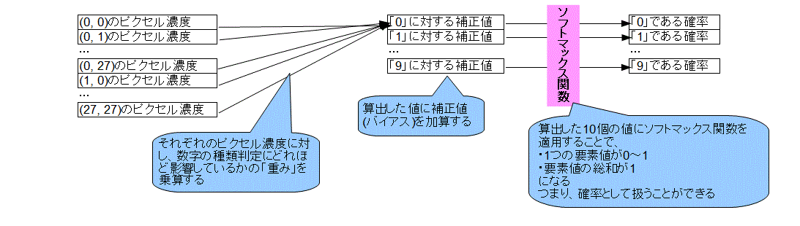
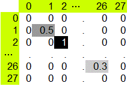

# チュートリアル_手書き文字(その1)

インストールに引き続き、TensorFlow公式サイトのチュートリアルをお勉強。  
手書き文字認識を使ってTensorFlowの動作を見ていく。  
MNIST For ML Beginners  
https://www.tensorflow.org/get_started/mnist/beginners  

チュートリアルは英語だが、日本語で解説しているサイトもあるのでこれらを活用。  
http://tensorflow.classcat.com/2016/03/09/tensorflow-cc-mnist-for-ml-beginners/  
https://qiita.com/uramonk/items/c207c948ccb6cd0a1346  

処理の内容をコメントしたソースコードはこちら  
[mnist_softmax.py](../source/TF_MNIST/mnist_softmax.py)  

やっていることは以下のような単純パーセプトロン。  
  

手書き文字画像は28*28ピクセルのモノクロ画像。  
真っ白のピクセルを0、真っ黒のピクセルを1として、ピクセルの濃さを表現する。  
  

各ピクセルについて、濃度と数字(0～9)の関連性(確率)を「重み」と「バイアス」を使って表していく。  
算出した確率と正解の誤差の程度を「交差エントロピー」を用いて表す。  
この交差エントロピーを「勾配降下法」で最小となるように、重みとバイアスを調整するのが、このニューラルネットワークにおける学習となる。

最後に、学習完了したニューラルネットワークにテストデータを入力し確率を算出する。  
これの正解率を検証したところ、おおよそ92%程度となった。

※この程度の計算ならそれほど時間はかからなかった。  
　使用したPCのスペックは以下の通り。  
　・CPU: Core i5-4200U 1.6GHz  
　・Memory: 4GB  
　・OS: Windows 10 64bit
