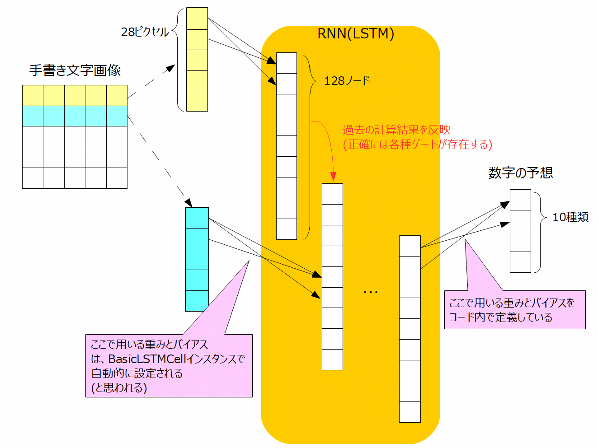

# 再帰的ニューラルネットワークを使用した手書き文字認識

TensorFlow公式サイトのチュートリアルにも、再帰的ニューラルネットワークについてのものがある。  
Recurrent Neural Networks  
https://www.tensorflow.org/tutorials/recurrent

日本語訳はこちらを参照。  
https://media.accel-brain.com/tensorflow-recurrent-neural-networks/

ただ、言語モデリングを扱うため、言語のベクトル表現を先に学習した方がよいらしい。  
※チュートリアルもその順序になっている。  
Vector Representations of Words  
https://www.tensorflow.org/versions/master/tutorials/word2vec

webでは手書き文字認識を題材に再帰的ニューラルネットワークの実装を行った例がある。  
今回はこちらの内容を見ていくことにする。  
RNN：時系列データを扱うRecurrent Neural Networksとは  
https://deepage.net/deep_learning/2017/05/23/recurrent-neural-networks.html

処理の内容をコメントしたソースコードはこちら  
[mnist_recurrent.py](../source/TF_MNIST/mnist_recurrent.py)  

仕組みとしては以下の図のようになっている。  
再帰型ニューラルネットワークは、LSTM(Long short-term memory)セルで構成されるものを使用する。  
LSTMセルは内部に隠れ層を持っており、今回は隠れ層の数を128に設定している。  
ここに手書き文字画像を上から1行ずつ読み込ませて、どの数字になるかの予想を行う。  
  

実行結果  
~~~
Test Accuracy: 0.984375
~~~

LSTMについては下記サイトに日本語訳のものがある。  
https://qiita.com/KojiOhki/items/89cd7b69a8a6239d67ca
